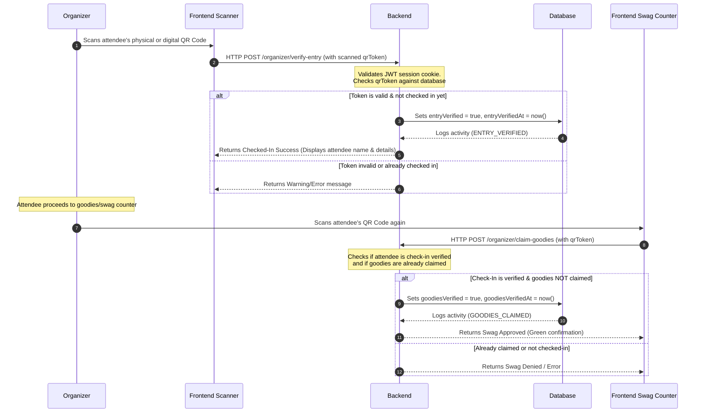

# AWS Community Day Event Management System - Project Guide

This document describes how the AWS Community Day Event Management System works, its core architecture, features, file structure, and technical stack.

---

## 🚀 Overview

The system is a full-stack web application designed to handle end-to-end event registration, attendee check-in, and swag (goodies) distribution for **AWS Community Day**. 

It consists of two main parts:
1. **Frontend**: A Next.js web application with a responsive public registration page and a secure, password-protected organizer portal featuring scanner tools and a dashboard.
2. **Backend**: A NestJS API service that handles participant registration, security tokens, QR code rendering, multi-provider email delivery, and check-in tracking.

---

## 🛠️ Tech Stack

### Frontend (Next.js Application)
* **Framework**: [Next.js v16.2.9](https://nextjs.org/) (utilizing the App Router and Turbopack compiler)
* **Library**: [React v19](https://react.dev/)
* **Styling**: [Tailwind CSS v4](https://tailwindcss.com/) (modern styling engine)
* **Animations**: [Framer Motion v12](https://www.framer.com/motion/) (for smooth, interactive transitions)
* **QR Scanning**: [HTML5-QRCode](https://github.com/mebjas/html5-qrcode) (webcam/camera-based scanning in the browser)
* **QR Generation**: [React-QR-Code](https://github.com/rosslh/react-qr-code)
* **Icons**: [Lucide React](https://lucide.dev/)

### Backend (NestJS API Service)
* **Framework**: [NestJS v11](https://nestjs.com/) (a progressive Node.js framework for scalable APIs)
* **Database Interface**: [Prisma ORM v6.19.3](https://www.prisma.io/) (type-safe database client)
* **Authentication**: [Passport.js](http://www.passportjs.org/) & JWT (JSON Web Tokens) with secure HTTP-only cookies
* **API Documentation**: [Swagger (OpenAPI v3)](https://swagger.io/) (rendered at `/docs` on the API server)
* **Validation**: [class-validator](https://github.com/typestack/class-validator) & [class-transformer](https://github.com/typestack/class-transformer)

### Database & Services
* **Database**: PostgreSQL (relational database storage)
* **Mailing Engines**:
  1. **Gmail SMTP** (via Nodemailer - Primary Email Carrier)
  2. **Resend API** (SDK - Fallback Email Carrier)
  3. **AWS SES** (AWS SDK Client - Fallback Email Carrier)

---

## 🏗️ System Architecture & Workflows

Below are the visual representations of the two primary system flows: **Participant Registration** and **Organizer Check-In & Swag Claims**.

### 1. Participant Registration Flow

```mermaid
sequenceDiagram
    autonumber
    Participant->>Frontend: Fills & submits registration form
    Frontend->>Backend: HTTP POST /registration (User data)
    Note over Backend: Backend validates form data<br/>and checks for duplicate emails
    Backend->>Database: Creates User (PARTICIPANT) & Registration records
    Note over Backend: Generates Unique Code (e.g. AWSCD2026-XXXX)<br/>and cryptographic qrToken
    Backend->>Backend: Generates QR Code Image with qrToken
    Backend->>Participant: Sends Email with QR Code (Gmail SMTP -> Resend -> AWS SES fallbacks)
    Database-->>Backend: Logs activity (PARTICIPANT_REGISTERED)
    Backend-->>Frontend: Returns Success response
    Frontend->>Participant: Displays registration success page
```

### 2. Organizer Check-In & Swag Verification Flow



---

## 📂 Project Structure

### Backend Structure
```
backend/
├── prisma/
│   ├── schema.prisma       # Database models & configuration (PostgreSQL)
│   └── seed.ts             # Database seeder (creates default organizer credentials)
├── src/
│   ├── activity-log/       # Log-handling for system audits
│   ├── auth/               # JWT strategy, guard, and controllers for login
│   ├── email/              # Nodetransmitter & fallback setup for emailing
│   ├── health/             # Terminus database & API health metrics
│   ├── organizer/          # Organizer endpoints (check-in, stats, CSV export, swag)
│   ├── prisma/             # Global PrismaService client instantiator
│   ├── qr/                 # QR generation helper
│   ├── registration/       # Participant registration pipelines
│   ├── main.ts             # Server configuration, CORS, Swagger, bootstrap
│   └── app.module.ts       # Module assembly
└── .env                    # System configurations (DB, Port, Keys)
```

### Frontend Structure
```
frontend/
├── src/
│   ├── app/
│   │   ├── layout.tsx      # Root HTML layout and fonts
│   │   ├── page.tsx        # Registration Landing page
│   │   └── organizer/
│   │       ├── login/      # Organizer Login interface
│   │       ├── dashboard/  # Registry statistics, logs table, actions
│   │       ├── entry/      # QR scanner page for attendee check-in
│   │       └── goodies/    # QR scanner page for swag distribution
│   ├── components/         # Reusable interactive components
│   ├── context/            # Shared React context providers
│   └── proxy.ts            # Route proxy (Next.js 16 route protection)
```

---

## ⚙️ Configuration & Execution

### 1. Database Migrations and Preparation
Before launching the servers, you must sync your database and seed default credentials:
```bash
# Move to backend folder
cd backend

# Push the schema definitions to your PostgreSQL database
npx prisma db push

# Seed the database (creates default organizer admin accounts)
npx prisma db seed
```

### 2. Launching Services Locally

#### Run Backend Server (API)
```bash
cd backend
npm run start:dev
```
* **API Address**: `http://localhost:5000`
* **Interactive Swagger Docs**: `http://localhost:5000/docs`

#### Run Frontend Server (Client Web App)
```bash
cd frontend
npm run dev
```
* **Client Address**: `http://localhost:3000`
* The application will run locally and talk directly to your backend API.
